# Lab-11: Explore the Service Trust Portal

## Lab scenario

In this lab, you will explore the features and content available from the Service Trust Portal. You will also visit the Trust Center and navigate to the six key privacy principles.

## Lab objectives

In this lab, you will complete the following tasks:

+ Task 1: Explore the Service Trust portal
+ Task 2: Explore on Trust Center and navigate to Microsoft’s six, key privacy principles

## Estimated timing: 30 minutes

## Architecture diagram

## Task 1: Explore the Service Trust portal

In this task you will explore the Service Trust portal and the different types of content available, you will learn how to access reports, and how to save reports to your library.

1. Within the virtual machine(VM) on the left, click Microsoft edge shortcut (Msdge) on the desktop and enter **https://servicetrust.microsoft.com/**.  This will bring you to the landing page for the Service Trust Portal. The Service Trust Portal contains details about Microsoft's implementation of controls and processes that protect our cloud services and the customer data therein.

   

1. You have now arrived at the Service Trust Portal.

   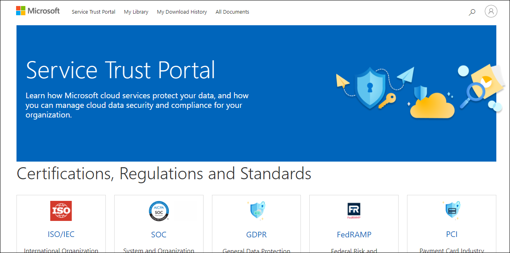

1. To access some of the resources on the Service Trust Portal, you must log in as an authenticated user with your Microsoft cloud services account and review and accept the Microsoft Non-Disclosure Agreement for Compliance Materials. To **Sign-in** Scroll down and select **ISO/ICE** which will be under Certifications, Regulations and Standards.
   
   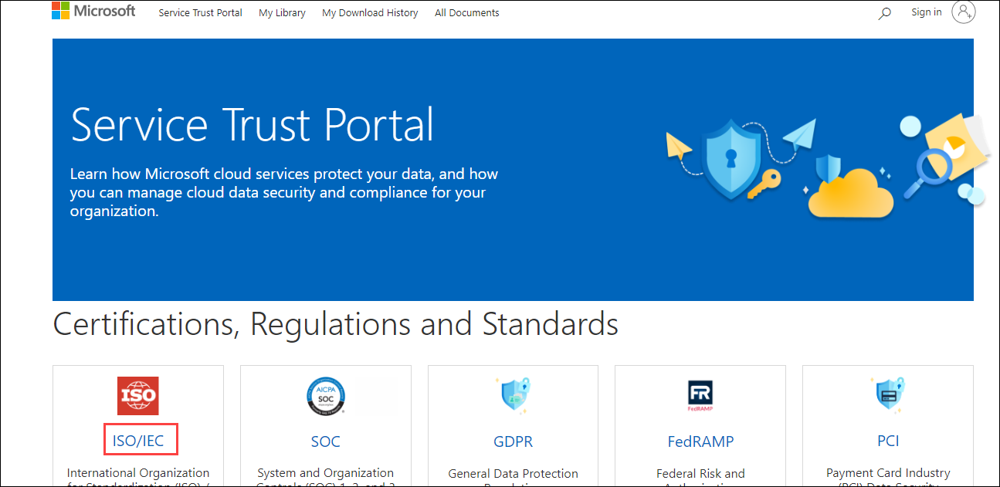

1. Click on **Sign in** blade.

   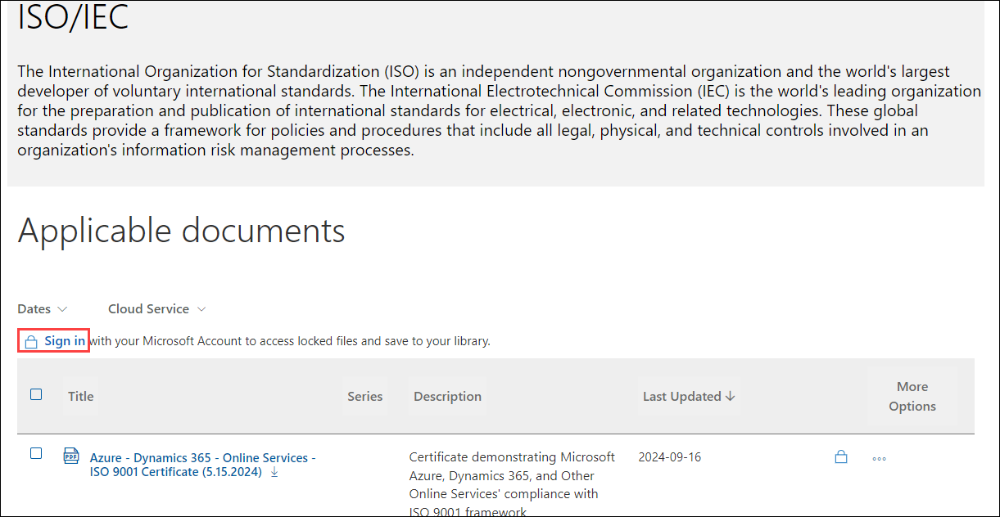

1. A login Screen appears, in that enter the following email/username and then click on **Next**. 
   * Email/Username: <inject key="AzureAdUserEmail"></inject>

     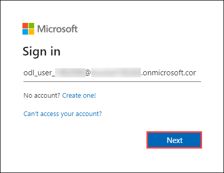
     

1. Now enter the following password and click on **Sign in**.
   * Password: <inject key="AzureAdUserPassword"></inject>

     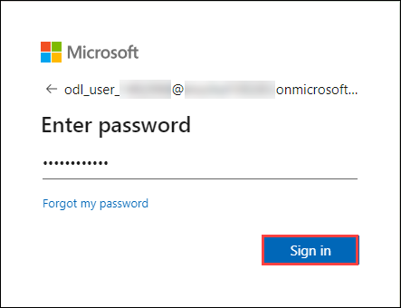
        
1. if prompted, select **Agree** to accept the Microsoft Non-Disclosure Agreement for Compliance Materials.

1. Note the description on the top of the page and available applicable documents. Select the **ellipsis(...) (1)** under the More Options and then select **Save to Library (2)**.

   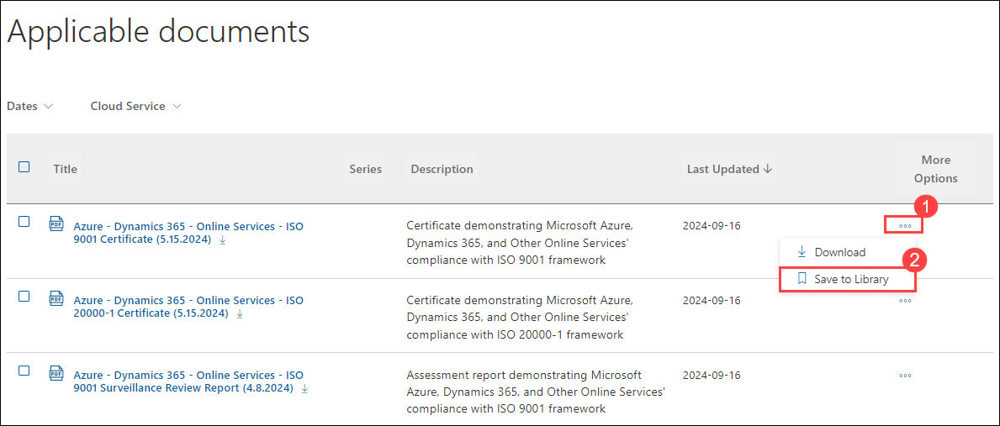
   
1. A window will pop up asking if you want to subscribe to this document.  Select **Yes**.

   
  
1. A window will pop up for notification settings, note the different settings and select **Daily** and Select **Save**.
 
   

1. To verify that the document has been saved, scroll up to the top of the page and select **My Library**, view the document that we have saved.

   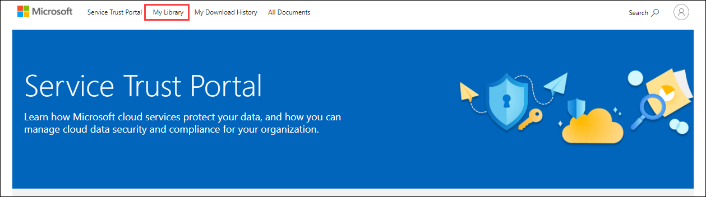
   
   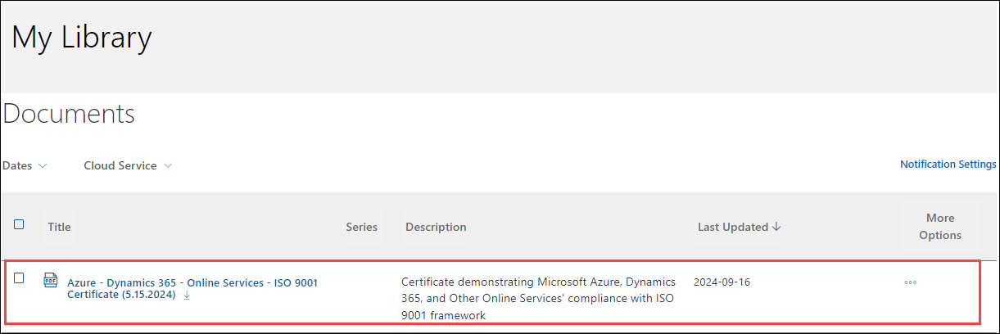

1. From the top of the My Library page, select **Service Trust Portal** to return to the Service Trust Portal home page.

   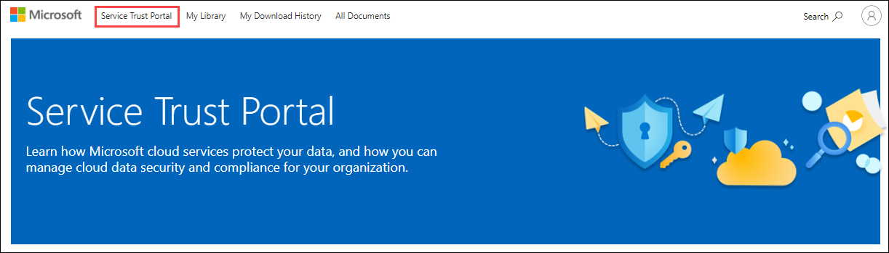
   
1. From the Service Trust Portal home page, scroll down to the **Industry and Regional Resources (1)** category.  Note the available tiles.  Select **Financial Services (2)**. 
 
   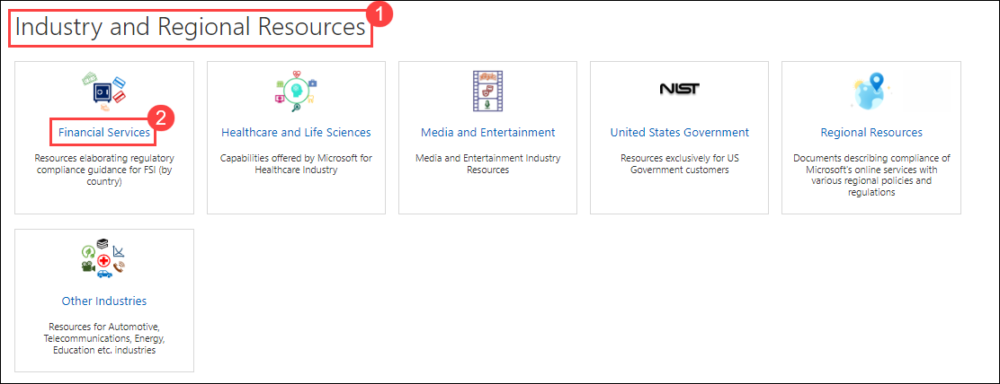

1. Scroll down to see all the available regions and countries.  Select the tile for any country to view the applicable documents.

   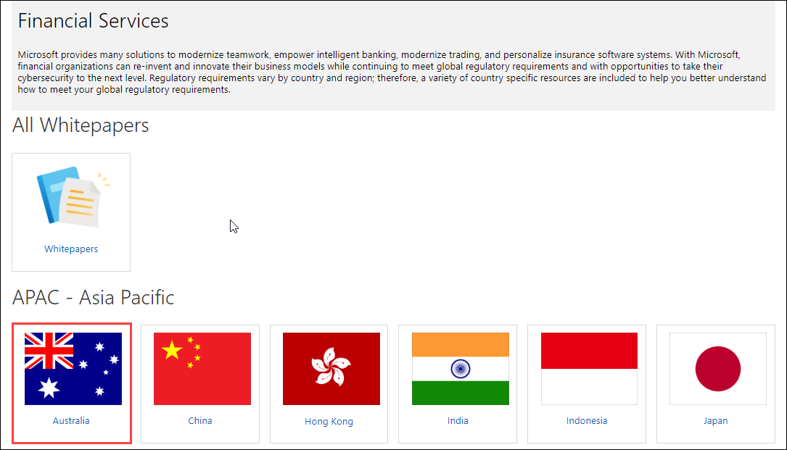

   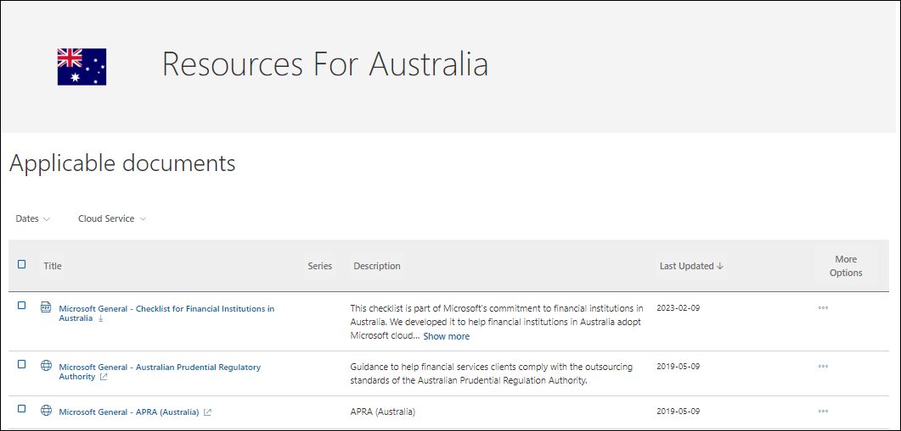   
 
1. Navigate back to the Service Trust Portal home page, select the link **Service Trust Portal** at the top of the page.
   
   
    
1. From the Service Trust Portal home page, scroll down to the **Resource for your Organization (1)** category. Select **Resources for your Organization (2)**.  Note that any documents listed here are based on your organization's subscription and permissions.    

   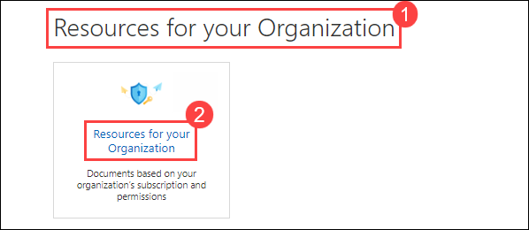
   
   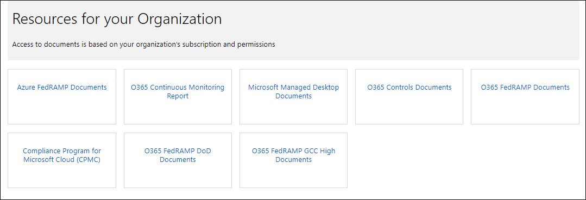
   
1. Navigate back to the Service Trust Portal home page, select the link **Service Trust Portal** at the top of the page.

   
    
## Task 2: Explore on Trust Center and navigate to Microsoft’s six, key privacy principles

In this task you will visit the Trust Center and navigate to Microsoft’s six, key privacy principles.

1. From the Service Trust Portal home page, scroll down to the **Reports, Whitepapers, and Artifacts (1)** category. Select **Privacy and Data Protection (2)**.  

   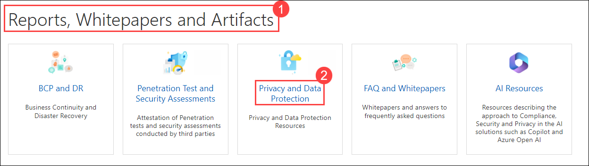

1. In addition to listing all applicable documents, there is a description of the category followed by a link to Learn more.  Select **Learn more**.

   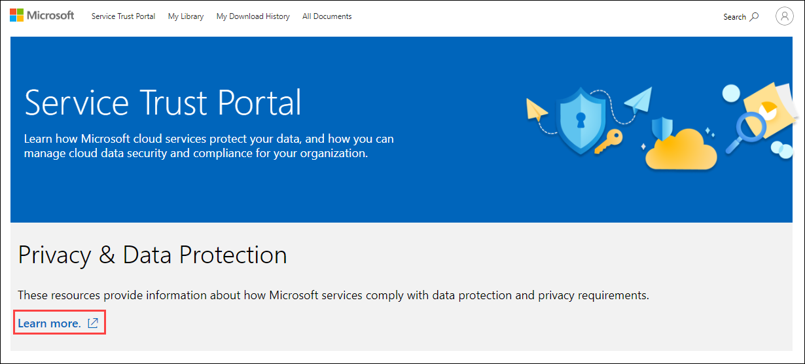

1. A new browser page opens to the Microsoft Trust Center where you find more information, including information about privacy and much more. Explore the contents of this page and navigate through different links.

   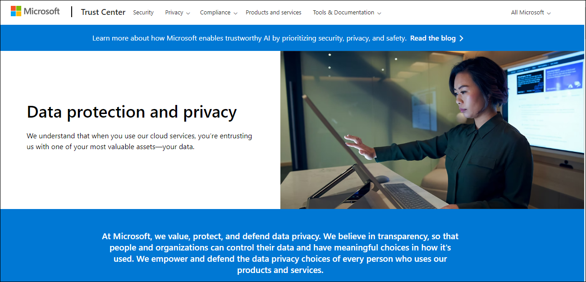

1. Close your browser windows to exit out the Service Trust Portal and the Trust Center.

## Review
In this lab, you have completed:
- Explore the Service Trust portal
- Explore on Trust Center and navigate to Microsoft’s six, key privacy principles
  
## You have successfully completed the lab
